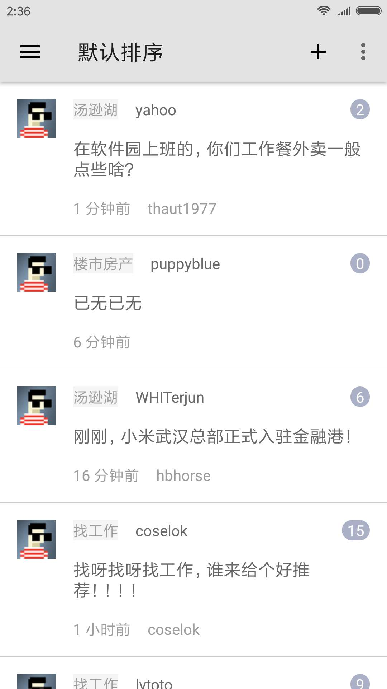
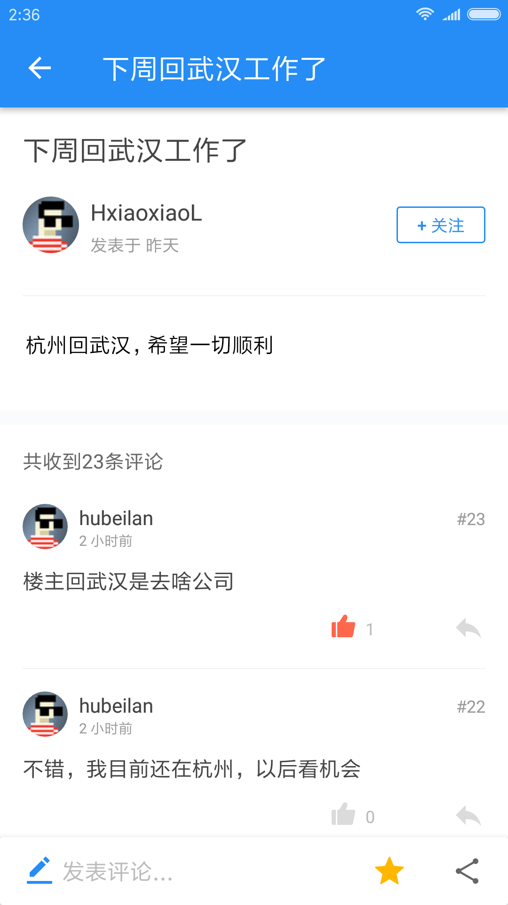

# guanggoo-android

[光谷社区](http://www.guanggoo.com) 第三方客户端。

**目录**
<!-- vim-markdown-toc GFM -->

* [屏幕截图](#屏幕截图)
* [功能列表](#功能列表)
* [界面特性](#界面特性)
* [优化](#优化)
* [API](#api)
* [License](#license)

<!-- vim-markdown-toc -->

## 屏幕截图

 

## 功能列表

- [x] 登录
- [x] 首页主题列表
    三种视图：默认排序、最新话题、精华主题
- [x] 主题详情
    - [x] 主题内容
    - [x] 评论列表
- [x] 节点列表
- [x] 节点主题列表
- [ ] 评论
    - [x] 文字评论
    - [ ] emoji
    - [x] 艾特
        目前仅支持长按头像或用户名
- [x] 分享主题链接
- [x] 新手指南
- [x] 个人信息页
    - [x] 个人基本信息
    - [x] 个人回复列表
    - [x] 个人主题列表
    - [x] 其它用户信息
- [ ] 消息提醒
- [ ] 收藏
- [x] 收藏的主题列表
- [ ] 发表新主题
- [ ] 登出
- [ ] 注册
- [ ] 搜索
- [ ] 已读/未读状态区分

## 界面特性

- [x] 主题详情支持动图和视频
- [x] ToolBar 设定
    - [x] 如果当前 Fragment 栈里的数量大于 1，就显示返回按钮，可以滑出 Drawer，否则显示菜单，锁定 Drawer
    - [x] 在合适的时候显示右侧菜单
- [x] 列表下拉刷新
- [x] 列表上滑加载更多
    - [x] 主题列表页自动加载
    - [x] 主题评论点击手动加载
- [x] Loading 动画
- [ ] 应用内处理图片与链接点开
- [x] 评论内容为空时评论按钮置灰
- [ ] 侧滑返回
- [ ] 评论按钮可以考虑做成 FloatActionButton
- [ ] 夜间模式

## 优化

- [ ] 添加缓存

## API

[docs/guanggoo-api.md](./docs/guanggoo-api.md)

因为光谷社区并未提供 API，所以是基于 DOM 解析，网站的前端界面改动有可能导致数据不可用，可以考虑做一个 API 监控脚本，定期测试 API 的可用性。

## License

[Apache License 2.0](https://github.com/mzlogin/guanggoo-android/blob/master/LICENSE)
