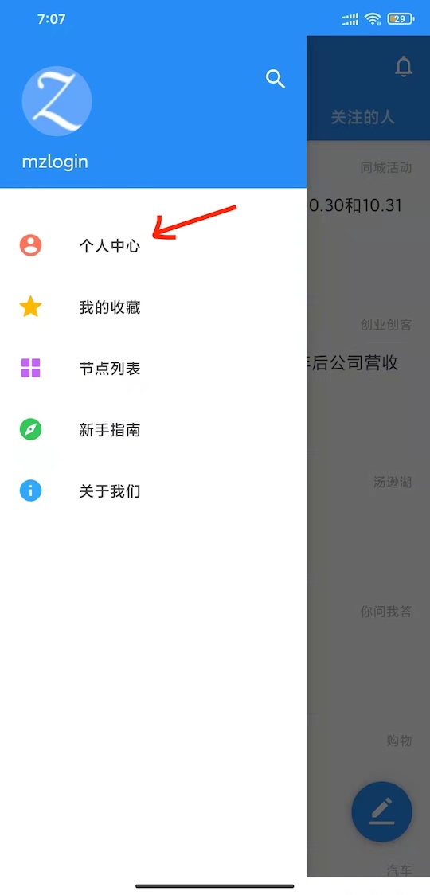

# 过早客 Android APP 图片上传使用说明

免费免登录的图床要么不长久，要么 API 不稳定，找一个有收费套餐，但给注册用户一定免费额度的图床是我觉得比较合适的选择。

尝试了几个之后，最终选择了 <https://sm.ms> 图床，主要是因为它免费额度够用，外链贴图展示友好，上传 API 简单（其实主要是这个，懒）。

在 APP 上需要配置一次 API KEY，后面就可以一直用了，用一次的麻烦换取长久的安逸。

## 如何获取图床 API KEY

1. 注册图床账号，注册链接：<https://sm.ms/register>，如已有账号可忽略此步骤；

     

2. 登录图床，登录链接：<https://sm.ms/login>；

    

3. 访问 Dashboard > API Token，直达链接：<https://sm.ms/home/apitoken>，页面上展示的 Secret Token 就是我们要的图床 API KEY，首次访问可能是空的，点击正文的 Generate Secret Token 按钮生成；

    

## 如何将 API KEY 配置进 APP

1. 打开「过早客」Android APP，调出侧边菜单，点击个人中心；

    

2. 点击个人中心右上角设置图标，进入设置界面；

    

3. 在设置界面填入获取到的图床 API KEY；

    API KEY 较长，建议复制粘贴，如果是在电脑上获取的 API KEY，可以在电脑上复制后发送到微信，从微信粘贴到 APP。

    
